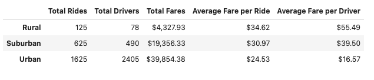
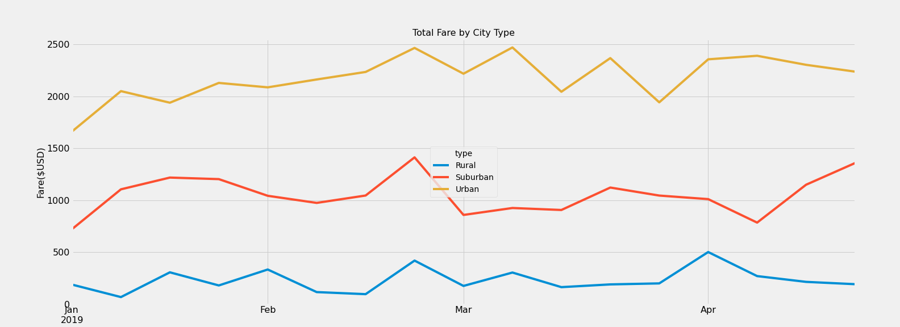

# PyBer Analysis

## Overview of project

The purpose of this analysis is to help the visualization of the dataset of PyBer ride-sharing based on city type (Urban, Suburban and Rural).
Using Python as the main tool, and with libraries such as Pandas and Matplotlin, reading CSV files, being able to create DataFrames. Plotting the visualizations to explicit the differences and best results on the city.
## Purpose
The purpose of this assignment is to use Pandas and Matplotlib to showcase our ability to read CSV files, create DataFrames using data series, merge DataFrames, and to use these DataFrames to produce statistical calculations and visualizations. This project specifically requests to use the ride data and city data to produce a summary DataFrame of the ride-sharing by city type. I will create a multiple-line graph that shows the total weekly fares for each city type. The city types are Urban, Suburban, and Rural.

The goal of this project is to use Matplotlib, Pandas and demonstrate ability to read CSV files, generate DataFrames from data series, combine DataFrames, and use these DataFrames to perform statistical calculations and summarize the view.  This assignment requires to work with the ride and city data to create a summary DataFrame of ride-sharing breakdown by city which are: urban, suburban, and rural. 
## Results
The starter code was the base to create the summary DataFrame by using pandas and the groupby function. Given that two CSV files were merged to generate the DataFrame. The groupby function was used to select the data series and merge them into a DataFrame by city. After putting together the datasets results in proceed with the following calculation:  
- Total of Rides per City Type
- Total Drivers per City Type
- Total Sum of Fares per City Type
- Average Fare per Ride per City Type
- Average Fare per Driver per City Type

The table above illustrates the number of rides, drivers, fares , and  those averages breakdown by city. The summary shows that Urban and Suburban have more drivers and riders than rural city type. Given that, it is possible to see that those two main cities generates significant fare amount considering the high usage in those cities. In contrast, the rural city has fewer rides and drivers resulting in the least Total fare amount. Rural city has the highest average fare due the low total riders and drivers in the city. Please see each category in detail below.
### Total Rides per City Type
The rides in urban areas had the highest total of rides 1,625. It is 2.6 times the total in the suburbs and 13 times the total in rural areas. This result is expected because Pyber's ride-sharing business has a greater pool of consumers in heavily populated locations.
### Total Drivers per City Type
The drivers in urban areas had the highest number of drivers  2,405. It is 4.9 times the total in suburbs and 30.8 times the total in rural cities. This outcome is expected because densely populated areas will involve more drivers.
### Total Sum of Fares per City Type

The fares in the urban cities had the highest total amount of fares $39,854.38. It is 2.1 times the total in suburban and 9.2 times the total in rural cities. 
### Average Fare per Ride per City Type

The average fare for local cities was the highest at $ 34.62. This is 1.4 times  the  average for cities and 1.1 times  the average for suburbs. Several factors can affect this high airfare. Local cities are generally unsuitable for commuting because the population is dispersed over less populated lands. Fares can take into account the distance traveled. Also, the number of people in the area using this service is decreasing. When there is no demand for services, drivers have less opportunity  to make money. Fares may be increased to make up for the lack of travel that drivers can make within a day. When demand is low, there is a shortage of drivers. As a result, a small number of people using this service pay high fees due to lack of driver availability.
### Average Fare per Driver per City Type

Local cities had the highest average fare per driver at $ 55.49. This is 3.4 times  the  average for cities and 1.4 times  the average for suburbs. There is little competition for drivers in local cities. As a result, these drivers get better rewards because their availability has a direct impact on price fluctuations. The city is full of drivers. As long as the driver is highly available, the price  is  affordable and competitive to attract users. If the usage time is long and there is a shortage of drivers in the city, the carpool service will raise the fare to meet the increasing demand. Please see below the graph illustrating the total fares by city type

This multi-line graph shows price fluctuations by city type from January to the end of April. Specifically, it displays the total fares for each city that are reported weekly. It looks not to reflect a clear statement because the line chart doesn't have any noticeable data points. Prices are fairly stagnant and relatively close to the total weekly average rates. Fares in  all cities will increase significantly only in the last week of February. Fares have risen by at least $ 500 this week for all city types.

## Summary
Given the complete analyses, please see the recommendations for each city type:
1. Allocate resources for expansion into local cities is not recommended. Several uncontrollable factors are hampering the growth of opportunities in these already difficult areas. Overall, locals are in favor of helping local businesses, not businesses. The competition in these areas is local taxi drivers who have been doing business in the area  for many generations. People are  willing to pay taxi drivers $ 55  because it helps the local economy. Instead, work with their local taxi driver to use the ride-sharing service as an additional platform to offer  the option to increase their daily travel. With their ride-sharing service, they'll be familiar with the technology of users who  normally don't require a ride, and get instant happy demographics. The aim is to organically increase the number of drivers in rural areas in order to lower  high fare barriers. By increasing the supply of drivers and providing revenue opportunities for drivers who dominate the local market, we  overcome the two biggest barriers to reaching new users.
2. In urban and suburbs, seek for alternatives to increase the average fare per driver. Both city types are saturated with driver and ride-sharing services. In a market full of ride-sharing services, drivers are looking for a job for a company that creates a stable travel flow  or pays fairly. Users are more attracted to our service if the average fare per trip is relatively cheap and competitive compared to other prices. It may not have raised the average fare per driver. Instead, it provides drivers with an incentive to meet the semi-aggressive quota of trips per week in order to receive large bonuses. In addition, if drivers consistently adhere to quotas, they will earn a higher percentage of their wages. By adding drivers to your fleet, you will be able to change the availability of drivers and serve more people.
3. The greatest growth opportunity  is in the suburbs. Total fares and rides  in the suburbs are far compared with total of those in the urban cities. The city is full of drivers and the market is also fiercely competitive. The suburbs are an affordable and happy medium  for users and drivers to likewise increase their one-way fares. In the suburbs, there are people who commute to work or leisure in the city. The suburbs are the most developed and  population growth fluctuates year by year. It seems that more people tend to move to the suburbs, as long as more restaurants, bars and shopping centers develop, the suburbs will have more opportunities to connect with new users. The recommendation is increase the number of drivers in the suburbs to increase their market share. 